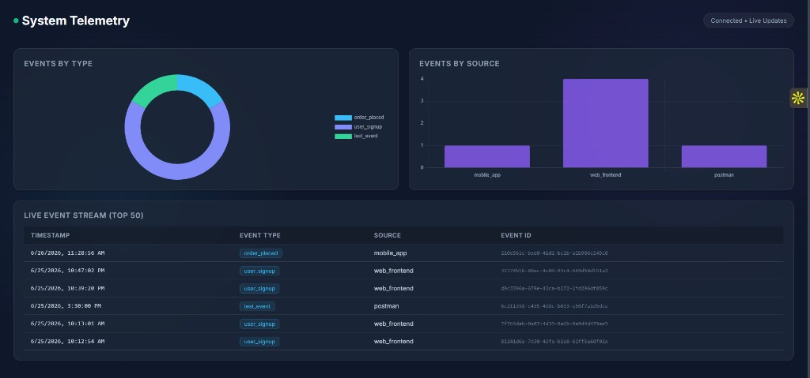
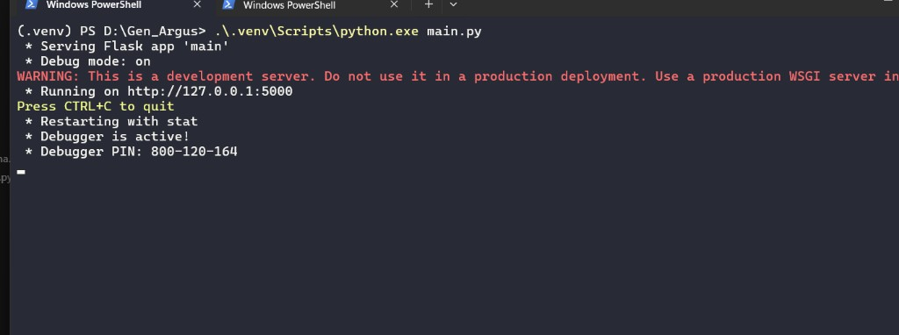
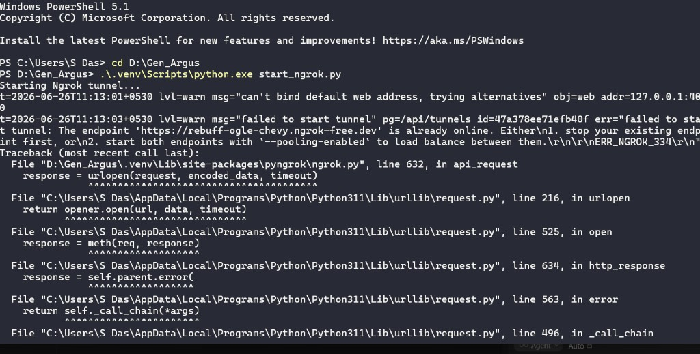

# Gen Argus

A real-time telemetry pipeline I built to ingest events from multiple sources, queue them through Kafka, persist them to PostgreSQL, and visualize everything on a live dashboard.

**Live demo:** [gen-argus.onrender.com/dashboard](https://gen-argus.onrender.com/dashboard)

---

## What I built

Most side projects stop at "POST data → save to DB." I wanted the full path you’d see in production: an API that accepts validated events, a message broker that decouples ingestion from storage, a background consumer that batches writes, and a dashboard that updates without a manual refresh.

The result is **Gen Argus** — a small but complete event pipeline that runs locally for development and deploys to the cloud without my machine being online.

---

## Screenshots

### Live dashboard (production — Render)

Events from `mobile_app`, `web_frontend`, and `postman` flowing into charts and the live event table. Status shows **Connected • Live Updates**.



### Local dev — Flask API running

```powershell
.\.venv\Scripts\python.exe main.py
```



### Local dev — ngrok public tunnel

Exposes the local API so external clients can hit `/ingest` without deploying.



---

## Architecture

```
Client (Postman / mobile / web)
        │
        ▼ POST /ingest  (+ x-api-key)
   Flask API (main.py)
        │
        ▼
   Kafka topic: system-events
        │
        ▼
   Consumer (receiver_kafka.py)
        │
        ▼
   PostgreSQL — system_events table
        │
        ▼
   Dashboard polls GET /api/events every 3s
```

**Why Kafka in the middle?** Ingestion spikes shouldn’t block the API or hammer the database directly. Kafka absorbs bursts; the consumer flushes to Postgres in batches (up to 1000 records or every 2 seconds).

---

## Tech stack

| Layer | Choice |
|-------|--------|
| API | Flask 3, Pydantic validation, gunicorn |
| Queue | Apache Kafka (Docker locally, Aiven in prod) |
| Database | PostgreSQL on Neon |
| ORM / queries | SQLAlchemy |
| Dashboard | HTML + Chart.js |
| Deploy | Render (web + worker) |
| Local tunnel | ngrok (optional) |

---

## Features

- **Authenticated ingest** — `POST /ingest` requires `x-api-key`
- **Schema validation** — invalid payloads return `422` with details
- **Kafka-first pipeline** — events queued before persistence
- **Batch consumer** — reduces DB write pressure
- **Live dashboard** — doughnut + bar charts, top-50 event table, 3s polling
- **Health check** — `GET /health` verifies DB connectivity
- **Cloud-ready** — Render blueprint + env helper script

---

## API

### `POST /ingest`

```json
{
  "event_id": "550e8400-e29b-41d4-a716-446655440000",
  "event_name": "order_placed",
  "timestamp": "2026-06-26T12:00:00Z",
  "source": "mobile_app",
  "payload": {
    "order_id": 999,
    "amount": 49.99
  }
}
```

**Header:** `x-api-key: your-api-key`

### Other routes

| Method | Path | Description |
|--------|------|-------------|
| GET | `/dashboard` | Live UI |
| GET | `/api/events` | Last 50 events (JSON) |
| GET | `/health` | DB health check |
| GET | `/test` | Smoke test |

---

## Local setup

### Prerequisites

- Python 3.11+
- Docker Desktop (for local Kafka)

### Install

```powershell
cd Gen_Argus
python -m venv .venv
.\.venv\Scripts\Activate.ps1
pip install -r requirements.txt
```

Create `.env`:

```env
DATABASE_URL=postgresql://...
KAFKA_BOOTSTRAP_SERVERS=localhost:9092
API_KEY=default-dev-key
ENVIRONMENT=dev
```

### Database

Run once on your Neon (or local Postgres) database:

```sql
CREATE TABLE IF NOT EXISTS system_events (
    id           UUID PRIMARY KEY,
    timestamp    TIMESTAMPTZ NOT NULL,
    service_name TEXT NOT NULL,
    environment  TEXT NOT NULL,
    event_type   TEXT NOT NULL,
    message      TEXT,
    metadata     JSONB
);
```

### Run (3 terminals)

**Terminal 1 — Kafka**
```powershell
docker run -d --name kafka -p 9092:9092 apache/kafka
# or: docker start kafka
```

**Terminal 2 — API**
```powershell
.\.venv\Scripts\python.exe main.py
```

**Terminal 3 — Consumer**
```powershell
.\.venv\Scripts\python.exe receiver_kafka.py
```

**Optional — public URL**
```powershell
pip install pyngrok
.\.venv\Scripts\python.exe start_ngrok.py
```

### Send a test event

```powershell
Invoke-RestMethod -Uri "http://127.0.0.1:5000/ingest" -Method POST -Headers @{
  "Content-Type" = "application/json"
  "x-api-key"    = "default-dev-key"
} -Body (@{
  event_id   = [guid]::NewGuid().ToString()
  event_name = "order_placed"
  timestamp  = (Get-Date).ToUniversalTime().ToString("yyyy-MM-ddTHH:mm:ssZ")
  source     = "mobile_app"
  payload    = @{ order_id = 999; amount = 49.99 }
} | ConvertTo-Json -Depth 5)
```

Open: [http://127.0.0.1:5000/dashboard](http://127.0.0.1:5000/dashboard)

---

## Production deployment (Render)

### Services

| Service | Type | Start command |
|---------|------|---------------|
| `telemetry-api` | Web | `gunicorn main:app --bind 0.0.0.0:$PORT` |
| `telemetry-consumer` | Worker | `python receiver_kafka.py` |

### Environment variables

Set on **both** services:

```
DATABASE_URL
KAFKA_BOOTSTRAP_SERVERS
KAFKA_USERNAME
KAFKA_PASSWORD
API_KEY
ENVIRONMENT
PYTHON_VERSION=3.11.9
```

Print everything from your local `.env`:

```powershell
.\.venv\Scripts\python.exe print_render_env.py --render
```

Paste into Render → **Environment → Add from .env**.

### Kafka (Aiven)

1. Create a Kafka service on [Aiven](https://aiven.io/free-kafka)
2. Wait until status is **Running**
3. Create topic: `system-events`
4. Copy connection details from **Users** (`avnadmin` + password)

### Deploy notes

- Pin **Python 3.11.9** — Render defaults to 3.14 which breaks older pydantic wheels
- Start command must be `gunicorn main:app` (not `gunicorn app:app`)
- Dashboard lives at `/dashboard`, not the root URL

---

## Project structure

```
Gen_Argus/
├── main.py                 # Flask API + dashboard routes
├── receiver_kafka.py       # Kafka consumer → Postgres
├── schemas/event.py        # Pydantic ingest schema
├── templates/dashboard.html
├── test_client.py          # Sample ingest client
├── print_render_env.py     # Render env var printer
├── start_ngrok.py          # Local public tunnel
├── render.yaml             # Render blueprint
├── Procfile
├── requirements.txt
├── .python-version
└── docs/screenshots/       # README proof images
```

---

## Capacity (current free-tier setup)

This is a working pipeline, not a hyperscale system. On Render free + Neon + Aiven free:

| Traffic | Comfortable range |
|---------|-------------------|
| Dashboard users | ~10–50 concurrent |
| Ingest | ~50–200 events/sec sustained |
| Daily volume | ~100k–500k events/day |

Beyond that you’d want paid tiers, caching, rate limiting, and horizontal scaling.

---

## Things I ran into (and fixed)

| Issue | What was going on |
|-------|-------------------|
| ngrok `ERR_NGROK_3200` | Tunnel wasn’t running — need `start_ngrok.py` open |
| `ModuleNotFoundError: flask` | Wrong Python — must use project `.venv` |
| Ingest OK, dashboard empty | Docker Kafka or consumer wasn’t running |
| Render build failed on pydantic | Python 3.14 default — pinned to 3.11.9 |
| Render crash on startup | Auto-detected `gunicorn app:app` — fixed to `main:app` |
| Root URL 404 | No `/` route — dashboard is at `/dashboard` |

---

## License

MIT
